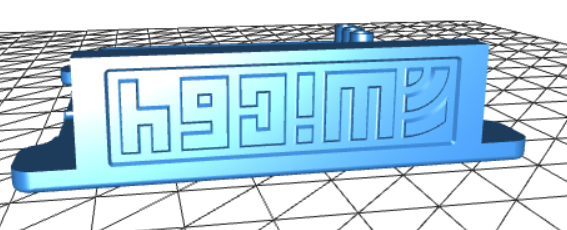
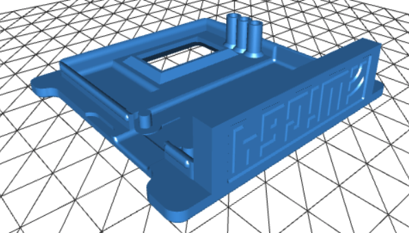
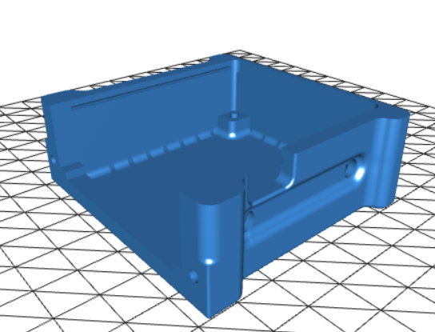

# WiC64-Case
WiC64 3D Druck Gehäuse print case 

  

Original from WiC64.de, modified:

 - TOP (Oberseite):
 - - flipped, cropped push buttons
 - - gredreht, kann direkt gedruckt werden
 - - kürze Tastenstößel für das ESP32-Modul
 
 

  

 
 - BOTTOM (Unterseite)
 - - cleaned, fully closed box enclosure
 - - ohne Lüftungsschlitze, kann schneller und einfacher gedruckt werden
 
  

  

 
 
 Have fun  ;-)
 
 cassy-de
